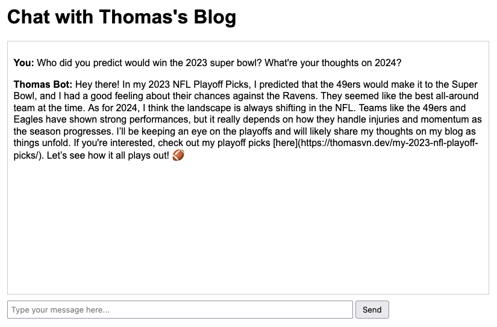

# chat.thomasvn.dev

[](https://app.netlify.com/sites/thomasvn/deploys)

## Demo

<https://chat.thomasvn.dev>



## Setup

Deploying the GCP Cloud Run Funciton:

```sh
gcloud functions deploy thomasvn-chat \
  --gen2 \
  --runtime=go122 \
  --region=us-west1 \
  --source=. \
  --entry-point=Chat \
  --trigger-http \
  --allow-unauthenticated \
  --memory=128Mi \
  --cpu=.083 \
  --env-vars-file=.env.yaml

gcloud functions describe thomasvn-chat --region=us-west1
gcloud functions delete thomasvn-chat --region=us-west1
```

Local Testing:

```sh
export OPENAI_API_KEY=""
export OPENAI_MODEL="gpt-4o-mini"
go run pkg/cmd/main.go "What has Thomas written about regarding Formula1?"
```

## References

- OpenAI Models (GPT-4o mini recommended)
  - <https://platform.openai.com/docs/models>
- LangChain
  - <https://github.com/tmc/langchaingo>
- Google Cloud Run Function v2
  - <https://cloud.google.com/functions/docs/create-deploy-http-go>
  - <https://github.com/GoogleCloudPlatform/functions-framework-go>

<!-- 
IDEAS
- Actual chat functionality. Ability to go back and forth with messages.
- Move GoogleCloudFunction into its own package? Would that still work?
- RAG (retrieval augmented API). Pull contents of all my blog posts. Make it a chat interface.
  - Serverless API can't be cloning the Repo every time. Should I put all my data onto a GCP bucket?
  - Make it a chat interface, where you can follow up on questions
  - https://github.com/tmc/langchaingo/blob/main/examples/document-qa-example/document_qa.go
  - https://github.com/tmc/langchaingo/blob/main/examples/chroma-vectorstore-example/chroma_vectorstore_example.go
- Pull contents of all Kubecost codebases & docs
- Build as a serverless container
-->

<!-- 
DONE (most recent to least recent)
- Enhance responses provided by OpenAI. Give the bot the ability to extrapolate. Custom prompt. GPT4o mini.
- Translate the HTML docs to Markdown. Reduces tokens.
- Deploy `chat.thomasvn.dev` site via Netlify
- Google Cloud Function v2. Deploy via API. Restructure code. https://cloud.google.com/functions/docs/create-deploy-http-go
- Expose it as an API via GCP Cloud Functions
- Graceful failure when cloning the repo
- Questions are parameterized and passed as CLI Args
-->
